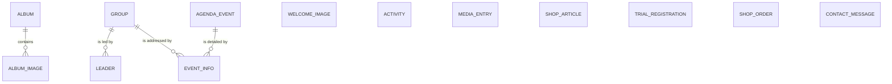

# Entity Model

The content of the website is kept in an external content management system and is
read by the website; the three form entities are not stored by the website but handed
over to the section as they are entered.

## Entity Relationship Diagram

### WELCOME_IMAGE

A picture that can be shown as the background of the welcome page.

| Attribute  | Description                                    | Data Type | Length/Precision | Validation Rules |
|------------|------------------------------------------------|-----------|------------------|------------------|
| id         | Unique identifier                              | String    | 24               | Primary Key      |
| image_path | Storage location of the picture                | String    | 255              | Not Null         |
| created    | Point in time at which the picture was added   | DateTime  | 19               | Not Null         |
| modified   | Point in time of the last change               | DateTime  | 19               | Not Null         |

### ACTIVITY

A typical activity of an afternoon, presented as a picture in the activity gallery.

| Attribute  | Description                                          | Data Type | Length/Precision | Validation Rules |
|------------|------------------------------------------------------|-----------|------------------|------------------|
| id         | Unique identifier                                    | String    | 24               | Primary Key      |
| title      | Designation of the activity                          | String    | 200              | Not Null         |
| image_path | Storage location of the picture in full size         | String    | 255              | Not Null         |
| thumb_path | Storage location of the picture in preview size      | String    | 255              | Not Null         |
| sort_order | Position of the activity within the gallery          | Integer   | 10               | Optional         |
| created    | Point in time at which the activity was added        | DateTime  | 19               | Not Null         |
| modified   | Point in time of the last change                     | DateTime  | 19               | Not Null         |

### AGENDA_EVENT

A planned afternoon or special event of the section.

| Attribute | Description                                                        | Data Type | Length/Precision | Validation Rules |
|-----------|--------------------------------------------------------------------|-----------|------------------|------------------|
| id        | Unique identifier                                                  | String    | 24               | Primary Key      |
| title     | Designation of the event including date and time as written text   | String    | 200              | Not Null         |
| text      | Description of the event with formatting                           | String    | 4000             | Not Null         |
| date      | Day on which the event takes place                                 | Date      | 10               | Not Null         |
| created   | Point in time at which the event was planned                       | DateTime  | 19               | Not Null         |
| modified  | Point in time of the last change                                   | DateTime  | 19               | Not Null         |

### EVENT_INFO

An announcement with detailed information about an event, addressed to one group or to the whole section.

| Attribute  | Description                                                   | Data Type | Length/Precision | Validation Rules                  |
|------------|---------------------------------------------------------------|-----------|------------------|-----------------------------------|
| id         | Unique identifier                                             | String    | 24               | Primary Key                       |
| event_date | Day of the event the announcement belongs to                  | Date      | 10               | Not Null                          |
| group_id   | Group the announcement is addressed to                        | String    | 24               | Not Null, Foreign Key (GROUP.id)  |
| text       | Announcement with meeting point, equipment and end of the day | String    | 4000             | Not Null                          |
| created    | Point in time at which the announcement was published         | DateTime  | 19               | Not Null                          |
| modified   | Point in time of the last change                              | DateTime  | 19               | Not Null                          |

### GROUP

An age group of the section, or the section as a whole, to which leaders and announcements belong.

| Attribute | Description                                     | Data Type | Length/Precision | Validation Rules |
|-----------|-------------------------------------------------|-----------|------------------|------------------|
| id        | Unique identifier                               | String    | 24               | Primary Key      |
| name      | Designation of the group as shown to the reader | String    | 100              | Not Null, Unique |

### ALBUM

A collection of pictures of one past afternoon or event.

| Attribute          | Description                                              | Data Type | Length/Precision | Validation Rules |
|--------------------|----------------------------------------------------------|-----------|------------------|------------------|
| id                 | Unique identifier                                        | String    | 24               | Primary Key      |
| title              | Designation of the album                                 | String    | 200              | Not Null         |
| date_text          | Date of the album as written text for the reader         | String    | 100              | Not Null         |
| date               | Day the album belongs to, used for the ordering          | Date      | 10               | Not Null         |
| year               | Year the album belongs to                                | Integer   | 4                | Not Null         |
| preview_image_path | Storage location of the picture shown on the album card  | String    | 255              | Not Null         |
| created            | Point in time at which the album was created             | DateTime  | 19               | Not Null         |
| modified           | Point in time of the last change                         | DateTime  | 19               | Not Null         |

### ALBUM_IMAGE

A single picture within an album.

| Attribute | Description                        | Data Type | Length/Precision | Validation Rules                 |
|-----------|------------------------------------|-----------|------------------|----------------------------------|
| asset_id  | Unique identifier of the picture   | String    | 24               | Primary Key                      |
| album_id  | Album the picture belongs to       | String    | 24               | Not Null, Foreign Key (ALBUM.id) |
| title     | Caption shown with the picture     | String    | 200              | Optional                         |
| path      | Storage location of the picture    | String    | 255              | Not Null                         |

### MEDIA_ENTRY

A press article about the section or a document from its history.

| Attribute   | Description                                                        | Data Type | Length/Precision | Validation Rules                  |
|-------------|--------------------------------------------------------------------|-----------|------------------|-----------------------------------|
| id          | Unique identifier                                                  | String    | 24               | Primary Key                       |
| type        | Classification of the entry                                        | String    | 20               | Not Null, Values: news, historic  |
| source      | Medium the entry originates from                                   | String    | 100              | Not Null                          |
| date        | Day of publication                                                 | Date      | 10               | Not Null                          |
| description | Summary of the entry with formatting                               | String    | 4000             | Not Null                          |
| file_path   | Storage location of the document belonging to the entry            | String    | 255              | Not Null                          |
| created     | Point in time at which the entry was added                         | DateTime  | 19               | Not Null                          |
| modified    | Point in time of the last change                                   | DateTime  | 19               | Not Null                          |

### SHOP_ARTICLE

An article offered by the section in its shop.

| Attribute   | Description                                              | Data Type | Length/Precision | Validation Rules                                       |
|-------------|----------------------------------------------------------|-----------|------------------|--------------------------------------------------------|
| id          | Unique identifier                                        | String    | 24               | Primary Key                                            |
| sort_key    | Position of the article within its category              | String    | 10               | Not Null                                               |
| name        | Designation of the article                               | String    | 200              | Not Null                                               |
| description | Remarks such as available sizes or remaining quantity    | String    | 500              | Not Null                                               |
| price       | Selling price in francs                                  | Decimal   | 10,2             | Not Null, Min: 0                                       |
| category    | Category the article is offered in                       | String    | 50               | Not Null, Values: Reguläre Artikel, Restposten         |
| image_path  | Storage location of the article picture                  | String    | 255              | Not Null                                               |
| created     | Point in time at which the article was added             | DateTime  | 19               | Not Null                                               |
| modified    | Point in time of the last change                         | DateTime  | 19               | Not Null                                               |

### LEADER

A person who leads a group of the section or the section as a whole.

| Attribute         | Description                                                        | Data Type | Length/Precision | Validation Rules                                                     |
|-------------------|--------------------------------------------------------------------|-----------|------------------|----------------------------------------------------------------------|
| id                | Unique identifier                                                  | String    | 24               | Primary Key                                                          |
| name              | Civil name of the leader                                           | String    | 100              | Not Null                                                             |
| scout_name        | Name used within the section                                       | String    | 50               | Not Null                                                             |
| is_active         | States whether the leader currently leads                          | Boolean   | 1                | Not Null                                                             |
| function          | Functions held, several of them possible                           | String    | 200              | Not Null, Values: Hilfsleiter, Gruppenleiter, Abteilungsleiter       |
| group_id          | Group the leader belongs to                                        | String    | 24               | Not Null, Foreign Key (GROUP.id)                                     |
| birth_year        | Year of birth                                                      | Integer   | 4                | Optional                                                             |
| place             | Place of residence                                                 | String    | 100              | Optional                                                             |
| profession        | Profession or school                                               | String    | 100              | Optional                                                             |
| recreation        | Hobbies                                                            | String    | 200              | Optional                                                             |
| in_scouts_since   | Statement since when the leader is in the section                  | String    | 50               | Optional                                                             |
| in_scouts_because | Statement why the leader is in the section                         | String    | 500              | Optional                                                             |
| best_experiences  | Statement about the best experiences in the section                | String    | 500              | Optional                                                             |
| image_path        | Storage location of the portrait                                   | String    | 255              | Not Null                                                             |
| created           | Point in time at which the leader was added                        | DateTime  | 19               | Not Null                                                             |
| modified          | Point in time of the last change                                   | DateTime  | 19               | Not Null                                                             |

### TRIAL_REGISTRATION

A registration of a child for a trial afternoon, handed over to the section and not stored by the website.

| Attribute    | Description                                                       | Data Type | Length/Precision | Validation Rules       |
|--------------|-------------------------------------------------------------------|-----------|------------------|------------------------|
| name         | Name of the person registering                                    | String    | 100              | Not Null               |
| email        | Email address for the answer                                      | String    | 100              | Not Null, Format: Email|
| phone_number | Telephone number for the answer                                   | String    | 30               | Not Null               |
| message      | Number and age of the children and the preferred date             | String    | 2000             | Not Null               |

### SHOP_ORDER

An order of articles, handed over to the section and not stored by the website.

| Attribute       | Description                                                              | Data Type | Length/Precision | Validation Rules                          |
|-----------------|--------------------------------------------------------------------------|-----------|------------------|-------------------------------------------|
| name            | Name of the ordering person                                              | String    | 100              | Not Null                                  |
| email           | Email address for the confirmation                                       | String    | 100              | Not Null, Format: Email                   |
| articles        | Articles wanted, described in the words of the ordering person           | String    | 2000             | Not Null                                  |
| delivery_method | Chosen way of handing the order over                                     | String    | 20               | Not Null, Values: Lieferung, Abholung     |
| address         | Delivery address, required when a delivery is chosen                     | String    | 500              | Optional                                  |

### CONTACT_MESSAGE

A question or remark sent to the section, handed over to it and not stored by the website.

| Attribute | Description                        | Data Type | Length/Precision | Validation Rules        |
|-----------|------------------------------------|-----------|------------------|-------------------------|
| name      | Name of the sender                 | String    | 100              | Not Null                |
| email     | Email address for the answer       | String    | 100              | Not Null, Format: Email |
| message   | Content of the message             | String    | 2000             | Not Null                |
